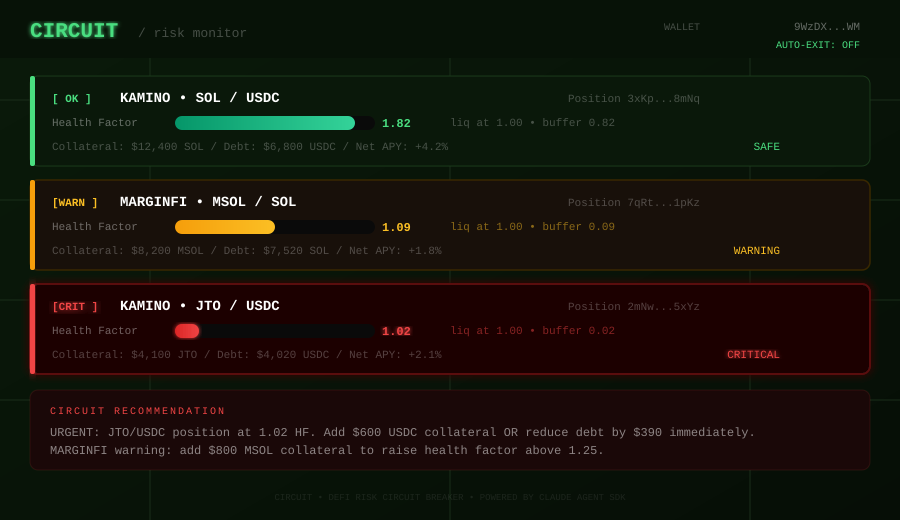
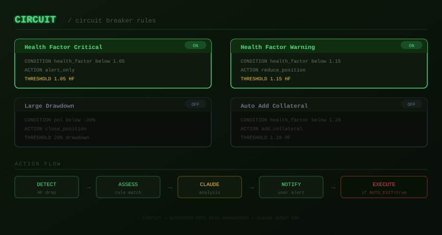

<div align="center">

# Circuit

**Automated DeFi circuit breaker for Solana.**
Monitors your Kamino and MarginFi positions every 15 seconds. When health factors get dangerous, Circuit tells you exactly what to do — or does it for you.

[](https://github.com/CircuitSOL/Circuit/actions)

[](https://docs.anthropic.com/en/docs/agents-and-tools/claude-agent-sdk)

</div>

---

Most DeFi liquidations are preventable. The position was unhealthy for hours before it blew up — nobody was watching. `Circuit` watches continuously, scores every position by risk level, and escalates through configurable rules. At critical health factors, Claude generates a precise action plan with exact dollar amounts. With `AUTO_EXIT=true`, it executes the plan automatically.

```
FETCH → ASSESS → MATCH RULES → ANALYZE → ACT
```

---

## Position Risk Dashboard



---

## Circuit Breaker Rules



---

## Risk Levels

| Level | Health Factor | Action |
|-------|--------------|--------|
| **SAFE** | > 1.20 | Monitor only |
| **WATCH** | 1.10 – 1.20 | Alert + suggestion |
| **WARNING** | 1.05 – 1.10 | Alert + reduce position |
| **CRITICAL** | < 1.05 | Immediate action required |

---

## Quick Start

```bash
git clone https://github.com/CircuitSOL/Circuit
cd Circuit && bun install
cp .env.example .env
# Set AUTO_EXIT=false to start (alert-only mode)
bun run dev
```

---

## License

MIT

---

*protect your positions before they protect themselves.*
